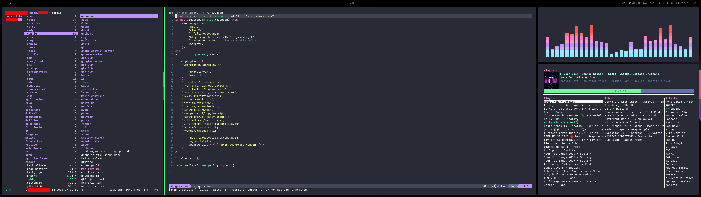

# dotfiles

* Window manager: [i3](https://i3wm.org/)
* Color theme: [dracula](https://draculatheme.com/)
* Compositor: None
* Status Bar: [polybar](https://github.com/polybar/polybar)
* Notifications: [dunst](https://github.com/dunst-project/dunst)
* Terminal: [kitty](https://sw.kovidgoyal.net/kitty/)
  * With [starship](https://starship.rs/)
* Text/Code editor: [nvim](https://neovim.io/)
  * With [packer](https://github.com/wbthomason/packer.nvim) plugin manager
  * Plugins: [nvim-tree](https://github.com/nvim-tree/nvim-tree.lua), [lualine](https://github.com/nvim-lualine/lualine.nvim), [treesitter](https://github.com/nvim-treesitter/nvim-treesitter), [gitsigns](https://github.com/lewis6991/gitsigns.nvim), [oil](https://github.com/stevearc/oil.nvim), [nvim-cmp](https://github.com/hrsh7th/nvim-cmp), [cmp-nvim-lsp](https://github.com/hrsh7th/cmp-nvim-lsp), [luasnip](https://github.com/L3MON4D3/LuaSnip), [friendly-snippets](https://github.com/rafamadriz/friendly-snippets), [mason](https://github.com/williamboman/mason.nvim), [mason-lspconfig](https://github.com/williamboman/mason-lspconfig.nvim), [nvim-lspconfig](https://github.com/neovim/nvim-lspconfig), [lspsaga](https://github.com/nvimdev/lspsaga.nvim), [telescope](https://github.com/nvim-telescope/telescope.nvim)
* File manager: [ranger](https://github.com/ranger/ranger) or nautilus
* Launcher / power menu: [rofi](https://github.com/davatorium/rofi)
* Audio: PulseAudio + pavucontrol
* Desktop background: [feh](https://feh.finalrewind.org/)
* Other stuff:
  * PDF viewer: [zathura](https://pwmt.org/projects/zathura/)
  * Music: [spotify-player](https://github.com/aome510/spotify-player)
  * Calendar: [calcurse](https://calcurse.org/) (with [calcurse-caldav](https://calcurse.org/files/calcurse-caldav.html) for gmail)
  * Mail: [cmdg](https://github.com/ThomasHabets/cmdg) (for gmail)
  * Audio visualizer: [cava](https://github.com/karlstav/cava)
  * Screenshots: [fireshot](https://flameshot.org/)
